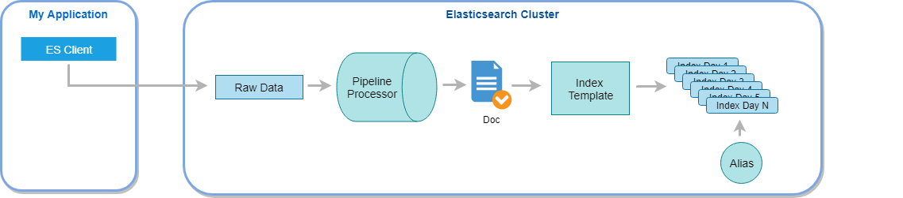

# transform-doc-pipeline-ELK

**Elasticsearch gives** you high flexibility to ingest data from a wide variety of sources, transform them and send them to your data cluster. What comes first to mind is **Logstash**, which supports inputs like files, databases,...even accepting requests over the Web. Moreover, an endless list of plugins allow you transform data freely. However, there may be other occasions you might use other tools. In that project we address the problem of indexing documents into a **Elasticsearch cluster** using **ingest** and **pipeline** features.

Imagine following scenario. Your company is engaged in the **vending machine** field and they developed time ago a full ERP which, among others, collects information about the present status of all the machines. That info is finally stored in the central database in different tables. The point is, how would you ingest those data in an Elastic cluster with the minor impact in your ERP and giving full freedom to DBA guys to transform them ?

My proposal is to define a **pipeline** with a list of **processors** which will transform the raw data. At the same time, an **index template** comes in handy to standarise our fields, and an **alias** will allow us to search in those new indices easily. Please, take a look at the diagram below with the big picture



The sequence of events is as follows

1. The ES client sends an index request with the pipeline `vending-pipeline` and raw data in JSON format like this
```
{
    "data": "VM001 MODEL-5289 0 2 5 9 40.415363 -3.707398 [fruit, salad] 2019-08-01T10:55:25.000Z 2019-08-15T01:00:00.000Z"
}
```
2. Before indexing, our pipeline starts to call all **processors**, one by one in the order they appear. The first one parses the raw data according to the pattern
```
"%{DATA:machine_cod} %{DATA:machine_model} %{NUMBER:product_apple} %{NUMBER:product_salad} %{NUMBER:product_juice} %{NUMBER:product_pear} %{NUMBER:location.lat} %{NUMBER:location.lon} %{DATA:tags} %{TIMESTAMP_ISO8601:last_filling} %{TIMESTAMP_ISO8601:collection_timestamp}"
```
3. The rest of processors transform/create/remove the document fields, building the final document
4. Once the document is ready, Elasticsearch master node indexes it creating a new index if necessary according to the template `vending-template`. Using the last field `collection_timestamp`, every new day forces the creation of a new index with the format `vending-machine-YYYY-MM-DD`
5. Finally, the alias `vending-machine` gives you the chance to search in all indices at the same time

In order to test everyting is working, I provide you with a short Python script, importing the appropiate client, but there are [Elasticsearch Clients](https://www.elastic.co/guide/en/elasticsearch/client/index.html) for most of the common programming languages. 
 
## Requirements

Do not struggle with a complex infrastructure to run and test this project. Only a **virtual machine** with **Ubuntu Server** would be enough. There several tools to hold a virtual machine, in this case I have opted for **Virtual Box**.

### Elasticsearch

If you are reading this, you are probably familiar with **Elastic Stack** and its core piece **Elasticsearch**. Its installation process is very well documented on [Elastic Site](https://www.elastic.co/guide/en/elasticsearch/reference/current/install-elasticsearch.html). Do not forget, you should use a `deb` package, suitable for **Ubuntu**.

Before starting, you may need to install the package `apt-transport-https`
```
$ sudo apt-get install apt-transport-https
```
Check your present Java version because perhaps yours is different from Java 8 or Java 11, which **Elasticsearch** needs
```
$ java -version
``` 
In case of several JMV on your system, use this command to change it and select the version 8 or 11
```
$ sudo update-alternatives --config java
```
Elasticsearch signs all its installation packages with a PGP key, download and install that key
```
$ wget -qO - https://artifacts.elastic.co/GPG-KEY-elasticsearch | sudo apt-key add -
``` 
Save the repository definition
```
$ echo "deb https://artifacts.elastic.co/packages/7.x/apt stable main" | sudo tee -a /etc/apt/sources.list.d/elastic-7.x.list
```
Install Elasticsearch. In this step, select the exact version you want to install, instead of the last one. Maybe you did not know you could do it. Anyway, feel free to use the current version, it is up to you. Personally, I never use the very last version
```
$ sudo apt-get update && sudo apt-get install elasticsearch=7.2.0
```
Some changes should be made in file `/etc/elasticsearch/elasticsearch.yml`. The first one to bind to this server from any other IP
```
network.host: 0.0.0.0
```
The second one allows us to skip the bootstrap checks, because it thinks you are in a production deployment
```
discovery.type: single-node
```
Enable and start the new service, it might takes a few minutes
```
$ sudo /bin/systemctl daemon-reload
$ sudo /bin/systemctl enable elasticsearch.service
$ sudo /bin/systemctl start elasticsearch.service
``` 
I bet you realised, we have not installed **Kibana**, a great tool included in the **ELK Stack** which allows us to use a JSON interface to work with your cluster easily, sending requests and so on. No worries, `curl` software is more than enough to fulfil this project. For instante, test installation is OK and Elasticsearch service is up
```
$ curl -XGET "localhost:9200"
```
You can list all the indices in your cluster with this command
```
$ curl -XGET "localhost:9200/_cat/indices?s=index"
```

### Python

It is up to you to use the provided Python script. If you finally do it, keep in mind `elasticsearch` package is necessary (major version 7, just in case). Installation is very easy with `pip3`
```
sudo apt install python3-pip
pip3 install elasticsearch>=7.0.0
```

## Index template

Index templates are very useful to control as much as possible new index creations, in particular when indices are created externally, by **Logstash** or **pipeline** processes. 

Creating our index template `vending-template` ensures name and type of fields are exactly as you want. This template applies to all new indices created with name following the pattern `vending-machine-*`.

You should run the command below to create this template. It is available in [ELK/vending-template.json](ELK/vending-template.json). If you make any mistake, run it again, template is overwritten
```
curl -XPUT "localhost:9200/_template/vending-template" -H "content-type: application/json" -d '
{
  "index_patterns": ["vending-machine-*"],
  "settings": {
    "number_of_shards": 1,
    "number_of_replicas": 0
  },
  "mappings": {
    "properties": {
      "machine_cod": {
        "type": "keyword"
      },
      "machine_model": {
        "type": "keyword"
      },
      "product_apple": {
        "type": "short"
      },
      "product_salad": {
        "type": "short"
      },
      "product_pear": {
        "type": "short"
      },
      "product_juice": {
        "type": "short"
      },
      "location": {
        "type": "geo_point"
      },
      "tags": {
        "type": "text"
      },
      "status": {
        "type": "keyword"
      },
      "last_filling": {
        "type": "date"
      },
      "ingest_timestamp": {
        "type": "date"
      },
      "collection_timestamp": {
        "type": "date"
      }
    }
  }
}'

```
Some of these fields appeared in the parse pattern, but others are calculated by the different processors through the pipeline. 

## Pipeline

Pipelines are an extremely powerful tool in Elasticsearch. You can think of them like a data converter between your original document and the document you want. This transformation is made thanks to an available [list of processors](https://www.elastic.co/guide/en/elasticsearch/reference/current/ingest-processors.html). It is important to note that the processors are executed in the order that you define.

To create the pipeline `vending-pipeline`, you must run the content of the provided file [ELK/vending-pipeline`.json](ELK/vending-pipeline.json). There is no need to explain each of the 18 processors, let us focus on the most interesting.

### grok

This processor parses the raw data splitting its content into 11 provisional fields
```
"grok": {
  "field": "data",
  "patterns": ["%{DATA:machine_cod} %{DATA:machine_model} %{NUMBER:product_apple} %{NUMBER:product_salad} %{NUMBER:product_juice} %{NUMBER:product_pear} %{NUMBER:location.lat} %{NUMBER:location.lon} %{DATA:tags} %{TIMESTAMP_ISO8601:last_filling} %{TIMESTAMP_ISO8601:collection_timestamp}"]
}
```
That field `data` is what our **ES Client** sends in JSON format. Once this processor finishes, you have 11 fields plus the `data` field you received.

### remove

After parsing the raw data, you do not need it any longer
```
"remove": {
  "field": "data"
}
```

### date_index_name

This processor sets the index name according to a given prefix, a date field and a date rounding. In short, regardless of the index name given by the ES Client request, every new index will match the pattern `vending-machine-YYYY-MM-DD`, using the `collection_timestamp` field
```
"date_index_name": {
  "field": "collection_timestamp",
  "index_name_prefix" : "vending-machine-",
  "date_rounding": "d"
}
```
You might think the ES Client should be responsible for the index name, maybe, but in this project, DBA guys want the control as far as possible.

### drop

If the raw data does not bring the machine code, all data are rejected and nothing is indexed
```
"drop": {
  "if": "ctx.machine_cod == \"\""
}
```

### split

The field tags comes as a list of strings separated by commas, the `split` processor allows you to convert it into a array of strings
```
"split": {
  "field": "tags",
  "separator": ","
}
```

### script

When you do not find an already made processor which fits what you need, feel free to create a piece of code using the `script` processor. In that project, I used it twice. This is the most interesting
```
  "script": {
    "lang": "painless",
    "source": "if ((ctx.product_apple * ctx.product_pear * ctx.product_salad * ctx.product_juice) == 0) {         ctx.status = \"RED\"; } else { ctx.status = \"GREEN\";}"
  }
```
I have added a new field `status` which might be useful in advance. As a rule of thumb, it is a good idea to take advantage of the pipeline process to make easier any later search or aggregation in those indices.

## Testing

Now, you just need to test everything works as expected. Feel free to use the Python script [index-data.py](tester/index-data.py)
```
from elasticsearch import Elasticsearch

import config

def main():

    # connect to Elasticsearch server
    es_client = Elasticsearch(config.ES_URL)

    # every line of data is a doc, Python uses the dict structure
    for data in config.VENDING_MACHINE_DATA:
        try:
            response = es_client.index(index=config.ES_INDEX,
                                       doc_type=config.ES_DOC, body=data,
                                       pipeline=config.ES_PIPELINE)
            print(data['data'] + ' -> ' + response['result'])
        except Exception:
            print('ERROR INDEXING -> ' + data['data'])


if __name__ == '__main__':
    main()
```
Use the [config](tester/config.py) file to include new test data. You must pass into the `body` parameter a list of dictionaries. Remember that every new day in the last field `collection_timestamp` creates a new index in your Elasticsearch cluster.

If you need to clean up your previously created indices. Below command is very useful
```
curl -XDELETE "localhost:9200/vending-machine-*"
```

## Alias

This feature is very handy when you are working with indices based on **time series**. Thanks to the `date_index_name` processor, all new indices names created by our pipeline will have the same prefix. You could use this, to set up an alias which point at all those indices at the same time.

Keep in mind you cannot create an alias without there being indices to point at. That is why you must create the alias `vending-machine` after running your testing.

The command below creates the alias `vending-machine`. It is available in [ELK/alias.json](ELK/alias.json)

```
curl -XPOST "localhost:9200/_aliases" -H "content-type: application/json" -d '
{
  "actions": [
    {
      "add": {
        "index": "vending-machine-*",
        "alias": "vending-machine"
      }
    }
  ]
}'
```
Now you could search in all indices at once with below command
```
curl -XGET "localhost:9200/vending-machine/_search?pretty" -H "content-type: application/json" -d '
{
  "query": {
    "match": {
      "status": "GREEN"
    }
  }
}'
```

## Wrapping up

In this project, I intend to show you another way of ingesting data into an Elasticsearch cluster, different from **Logstash**. We have learnt

* Install Elasticsearch
* Ingest data using an ES Client
* Index templates
* Implement a complex pipeline with a wide range of processors
* Alias in Elasticsearch

## What's next

For sure, some changes or improvements are coming to your mind. For instance

* Error handling is missing on purpose in the pipeline
* The set of fields could be more complex
* What about if `tags` field comes like this `[]`?
* An alias for only the last year data

From now on.... it's all yours!